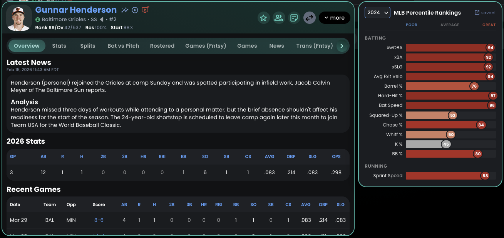

# FantraxBaseball+

Browser extension that enhances Fantrax fantasy baseball with quick-access links and live game integration. Available for Chrome and Firefox.

## Screenshots

### Player Modal
Statcast percentile rankings and quick-access links on the player card.



### Inline Video
MLB Film Room highlights with filter tabs and auto-advancing playlist.


### Live Game Scores
Live score, inning, and MLB.tv link right on the roster row.


### Player Tables
Icons on every row in roster, matchup, and transaction tables.


## Features

- **Statcast** - links to Baseball Savant player page
- **MLB Video** - inline video modal with filtered highlights
- **Live MLB.tv** - red pulsing icon links directly to the MLB.tv stream when a player's game is live

Links appear in two places:
- **Player modals** - larger icons next to the player name
- **Roster/matchup/transaction tables** - small icons on the position line

### Video Modal

Clicking the video icon opens a modal with:
- 16:9 video player with auto-play
- Scrollable video list sidebar with infinite scroll
- Auto-advances to the next video when current one ends
- Filter buttons in the header bar:
  - **Hitters**: All BIP (balls in play), Hits, Home Runs
  - **Pitchers**: All Highlights, Strikeouts, HRs Against

## Install

### Chrome Web Store
<!-- TODO: Add Chrome Web Store link after publishing -->

### Firefox Add-ons
<!-- TODO: Add AMO link after publishing -->

### Manual / Development

1. Clone the repo
2. Run `./build.sh` to generate browser packages in `dist/`
3. **Chrome**: Go to `chrome://extensions/`, enable Developer mode, click "Load unpacked", select `dist/chrome/`
4. **Firefox**: Go to `about:debugging#/runtime/this-firefox`, click "Load Temporary Add-on", select `dist/firefox/manifest.json`

## How It Works

- Content script injects links into Fantrax DOM elements via a MutationObserver
- MLB player IDs are looked up via the [MLB Stats API](https://statsapi.mlb.com/api/v1/people/search)
- Videos are fetched from the MLB Film Room GraphQL API (`fastball-gateway.mlb.com`) via the background script
- Hitter videos use structured queries with `HitResult` and `HitDistance` filters
- Pitcher highlights use FREETEXT search; strikeout/HR filters use structured queries
- `declarativeNetRequest` rules inject headers for `fastball-clips.mlb.com` video playback
- Live game detection uses the MLB Schedule API, matched to player teams parsed from the Fantrax DOM
- Abbreviated player names in transactions are resolved via the Fantrax `getTransactionDetailsHistory` API

## Project Structure

```
src/
  background.js          # Shared background script (GraphQL proxy)
  shared/
    content.js           # Content script injected into Fantrax pages
    content.css          # Styles for injected links and video modal
    icons/               # Extension icons (16, 48, 96, 128px)
  chrome/
    manifest.json        # Chrome MV3 manifest (service worker)
    rules.json           # declarativeNetRequest header rules
  firefox/
    manifest.json        # Firefox MV3 manifest (event page)
build.sh                 # Builds dist/chrome/ and dist/firefox/ zips
```
