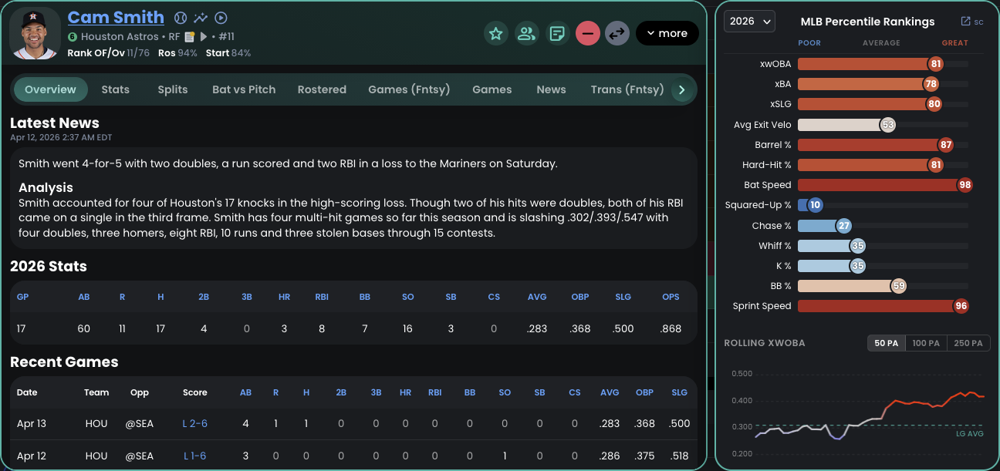
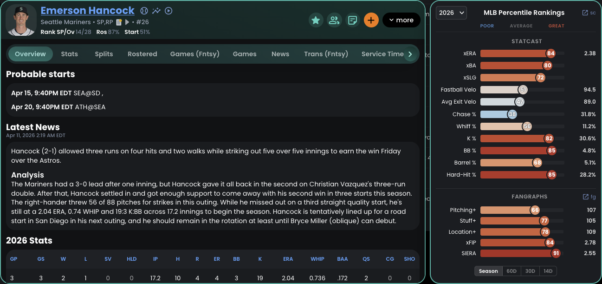
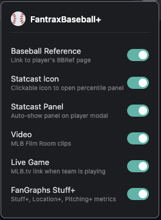

<h1>
  
  FantraxBaseball+
  <a href="https://addons.mozilla.org/en-US/firefox/addon/fantraxbaseball/"></a>
  <a href="https://chromewebstore.google.com/detail/fantraxbaseball+/andhmhfiodkbfmjiencoiglmdpolhomc"></a>
</h1>

Browser extension that enhances Fantrax fantasy baseball with Statcast and FanGraphs data, quick-access links, and live game integration. Available for Chrome and Firefox.

## Screenshots

### Hitter Card
Statcast percentile rankings, rolling xwOBA chart, and quick-access links.



### Pitcher Card
Statcast percentiles, FanGraphs Stuff+/Location+/Pitching+ ratings, and quick-access links.



### Inline Video
MLB Film Room highlights with filter tabs and auto-advancing playlist.


### Live Game Link
Pulsing live icon links to the stream when a player's game is in progress.


### Settings Panel
Toggle individual features on/off from the toolbar popup.



## Features

- **Baseball Reference** - links to the player's BBRef page (direct via MLB ID, search fallback)
- **Statcast** - links to Baseball Savant player page, plus a percentile rankings panel on the player card with statcast-style colored bars
- **Rolling xwOBA** - interactive chart on hitter cards showing expected wOBA over a rolling window
- **FanGraphs** - pitcher cards show Stuff+, Location+, Pitching+, xFIP, and SIERA with percentile-style bars
- **MLB Video** - inline video modal with filtered highlights
- **Live Game** - red pulsing icon links directly to the live stream when a player's game is in progress. Exclusive broadcasts (Peacock, Apple TV+, ESPN, Netflix, TBS) link to the correct streaming platform instead of MLB.tv

Links and stats appear in two places:
- **Player modals** - larger icons next to the player name, with Statcast/FanGraphs panels and rolling xwOBA chart below
- **Roster/matchup/transaction/player search tables** - small icons on the position line

All features can be individually toggled on/off from the extension toolbar popup. Settings sync across devices.

### Video Modal

Clicking the video icon opens a modal with:
- 16:9 video player with auto-play
- Scrollable video list sidebar with infinite scroll
- Auto-advances to the next video when current one ends
- Filter buttons in the header bar:
  - **Hitters**: All BIP (balls in play), Hits, Home Runs
  - **Pitchers**: All Highlights, Strikeouts, HRs Against

## Install

### Chrome Web Store
[Install from Chrome Web Store](https://chromewebstore.google.com/detail/fantraxbaseball+/andhmhfiodkbfmjiencoiglmdpolhomc)

### Firefox Add-ons
[Install from Firefox Add-ons](https://addons.mozilla.org/en-US/firefox/addon/fantraxbaseball/)

### Manual / Development

1. Clone the repo
2. Run `./build.sh` to generate browser packages in `dist/`
3. **Chrome**: Go to `chrome://extensions/`, enable Developer mode, click "Load unpacked", select `dist/chrome/`
4. **Firefox**: Go to `about:debugging#/runtime/this-firefox`, click "Load Temporary Add-on", select `dist/firefox/manifest.json`

## How It Works

- Content script injects links into Fantrax DOM elements via a MutationObserver
- MLB player IDs are looked up via the [MLB Stats API](https://statsapi.mlb.com/api/v1/people/search)
- Videos are fetched from the MLB Film Room GraphQL API (`fastball-gateway.mlb.com`) via the background script
- Hitter videos use structured queries with `HitResult` and `HitDistance` filters; pitcher highlights use FREETEXT search; strikeout/HR filters use structured queries
- Statcast percentile data is fetched from Baseball Savant; rolling xwOBA chart renders on a `<canvas>` element for hitters
- FanGraphs pitcher stats (Stuff+, Location+, Pitching+, xFIP, SIERA) are fetched from the FanGraphs leaderboard API
- `declarativeNetRequest` rules inject headers for `fastball-clips.mlb.com` video playback
- Live game detection uses the MLB Schedule API (with `broadcasts` hydration), matched to player teams parsed from the Fantrax DOM
- Exclusive broadcasts (Peacock, Apple TV+, ESPN, Netflix, TBS) are detected via `availabilityCode: "exclusive"` and routed to the streaming platform
- Abbreviated player names in transactions are resolved via the Fantrax `getTransactionDetailsHistory` API

## Project Structure

```
src/
  background.js          # Shared background script (GraphQL proxy)
  shared/
    content.js           # Content script injected into Fantrax pages
    content.css          # Styles for injected links and video modal
    popup.html           # Toolbar popup with feature toggle switches
    popup.js             # Reads/writes settings to browser.storage.sync
    icons/               # Extension icons (16, 48, 96, 128px)
  chrome/
    manifest.json        # Chrome MV3 manifest (service worker)
    rules.json           # declarativeNetRequest header rules
  firefox/
    manifest.json        # Firefox MV3 manifest (event page)
build.sh                 # Builds dist/chrome/ and dist/firefox/ zips
```
